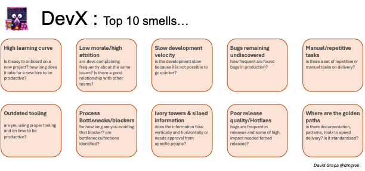

# Developer Experience (DevEx) Knowledge Base

## Introduction

Welcome to the Developer Experience Knowledge Base, a comprehensive resource dedicated to understanding, measuring, and improving the experience of developers within software development environments. This repository serves as a central hub for best practices, articles, tools, and methodologies focused on enhancing developer productivity, satisfaction, and effectiveness.

### What is Developer Experience (DevEx)?

Developer Experience (DevEx) refers to the overall experience that developers have when working with software tools, platforms, and processes. It encompasses everything from the quality of documentation and APIs to the efficiency of workflows, tooling, and infrastructure. Good DevEx removes friction and enables developers to focus on what matters most: building great software.

DevEx is to developers what User Experience (UX) is to end-users. Just as poor UX can drive away users, suboptimal DevEx can lead to decreased productivity, increased frustration, and higher turnover among development teams.

### Why DevEx Matters

- **Productivity**: Better developer experience translates directly to increased productivity and faster delivery cycles
- **Quality**: When developers can focus on their core work without fighting their tools, code quality improves
- **Retention**: Developers are more likely to stay with organizations that invest in making their work experience smooth and enjoyable
- **Innovation**: Good DevEx frees up mental bandwidth for creative problem-solving and innovation
- **Cost Efficiency**: Reducing development friction saves significant time and money across projects

## Top 10 Signs Your DevEx Needs Improvement

## Core Components of Good DevEx

### 1. Development Environment

- **Consistency**: Development environments match production as closely as possible
- **Automation**: Environment setup and updates are automated and reliable
- **Performance**: Local development is sufficiently fast for iterative work
- **Tooling**: IDEs and development tools are optimized for the specific work

### 2. Documentation and Knowledge Sharing

- **Comprehensive Coverage**: Documentation covers all essential systems and processes
- **Accuracy**: Documentation is up-to-date and regularly maintained
- **Accessibility**: Information is easy to find and navigate
- **Contextual Help**: Help and documentation are available where developers need it

### 3. Developer Workflows

- **Streamlined Processes**: Common tasks have minimal friction and unnecessary steps
- **Automation**: Repetitive tasks are automated wherever possible
- **Fast Feedback**: Developers receive quick feedback on the correctness of their changes
- **Collaboration Support**: Tools and processes facilitate smooth collaboration

### 4. Infrastructure and Platform

- **Reliability**: Infrastructure is reliable and predictable
- **Observability**: Systems provide visibility into their operation
- **Self-Service**: Developers can access resources without administrative bottlenecks
- **Scalability**: Infrastructure scales to meet development needs

### 5. Organizational Culture

- **Developer Focus**: The organization values and prioritizes developer productivity
- **Learning Culture**: Continuous learning and improvement are encouraged
- **Psychological Safety**: Developers feel safe to experiment, fail, and learn
- **Cross-Functional Collaboration**: Teams work together to optimize the entire development lifecycle

## Measuring Developer Experience

### Qualitative Measures

- **Developer Satisfaction Surveys**: Regular assessment of developer sentiment
- **Onboarding Feedback**: Insights from new team members
- **Exit Interviews**: Understanding why developers leave
- **Focus Groups**: In-depth discussions about specific DevEx aspects

### Quantitative Metrics

- **DORA Metrics**: Deployment frequency, lead time, change failure rate, time to restore service
- **Flow Metrics**: Cycle time, wait time, work item age
- **Developer Productivity**: Build times, test execution times, time to first productive commit
- **System Performance**: Infrastructure reliability, API response times
- **Code Quality**: Defect rates, technical debt measurements

### Implementing DevEx Measurement

- **Balanced Approach**: Combine qualitative and quantitative measures
- **Regular Cadence**: Establish a regular schedule for assessment
- **Actionable Insights**: Ensure metrics drive concrete improvements
- **Transparent Reporting**: Share findings and progress with the team

## DevEx Improvement Strategies

### Quick Wins

- **Documentation Improvements**: Update and organize existing documentation
- **Development Scripts**: Create scripts to automate common tasks
- **Error Message Enhancement**: Improve error messages to be more actionable
- **Knowledge Sharing Sessions**: Regular sessions to share tribal knowledge

### Medium-Term Initiatives

- **CI/CD Pipeline Optimization**: Improve build and test performance
- **Developer Portals**: Create centralized hubs for developer resources
- **Standardized Environments**: Implement container-based development environments
- **Workflow Automation**: Automate repetitive aspects of the development workflow

### Long-Term Investments

- **Platform Engineering**: Dedicated teams focused on internal developer platforms
- **Architecture Modernization**: Refactor systems for improved developer experience
- **DevEx Culture**: Build a culture that prioritizes developer experience
- **Tools Consolidation**: Reduce tool sprawl and context switching

## Tools and Resources

### Developer Portals and Internal Platforms

- [Backstage](https://backstage.io/) - Open platform for building developer portals
- [Port](https://www.getport.io/) - Developer portal platform
- [OpsLevel](https://www.opslevel.com/) - Service catalog and developer portal

### Development Environment Tools

- [Docker](https://www.docker.com/) - Containerization platform
- [GitPod](https://www.gitpod.io/) - Cloud development environments
- [GitHub Codespaces](https://github.com/features/codespaces) - Cloud-based development environment

### Documentation Tools

- [Docusaurus](https://docusaurus.io/) - Documentation website generator
- [MkDocs](https://www.mkdocs.org/) - Project documentation tool
- [Notion](https://www.notion.so/) - All-in-one workspace for notes and docs

### Workflow and Automation

- [GitHub Actions](https://github.com/features/actions) - CI/CD and automation
- [GitLab CI](https://docs.gitlab.com/ee/ci/) - CI/CD pipeline tool
- [Nx](https://nx.dev/) - Smart, extensible build framework

### Measurement and Analytics

- [GetDx](https://getdx.com/) - Developer Experience assessment framework
- [LinearB](https://linearb.io/) - Engineering metrics and workflow optimization
- [Swarmia](https://www.swarmia.com/) - Engineering effectiveness platform

## Case Studies
Common case studies in companies

### Spotify: Backstage Implementation
Spotify developed and implemented Backstage, an open-source developer portal, to address challenges with developer productivity and service discovery.

Key actions:
- Created a centralized platform for service documentation
- Implemented standardized templates for new services
- Established a plugin ecosystem for extensibility

Results:
- 55% reduction in time spent setting up new services
- 50% decrease in onboarding time for new developers
- Improved cross-team collaboration and knowledge sharing

## Contributing

We welcome contributions to this knowledge base! Here's how you can help:

1. **Add New Content**: Share articles, best practices, or case studies
2. **Improve Existing Content**: Help keep our information accurate and up-to-date
3. **Share Tools**: Recommend tools that improve developer experience
4. **Report Issues**: Let us know about problems or suggest improvements

Please see our [CONTRIBUTING.md](CONTRIBUTING.md) file for detailed guidelines.

## License

This knowledge base is licensed under [MIT License](LICENSE.md). See the LICENSE file for details.
